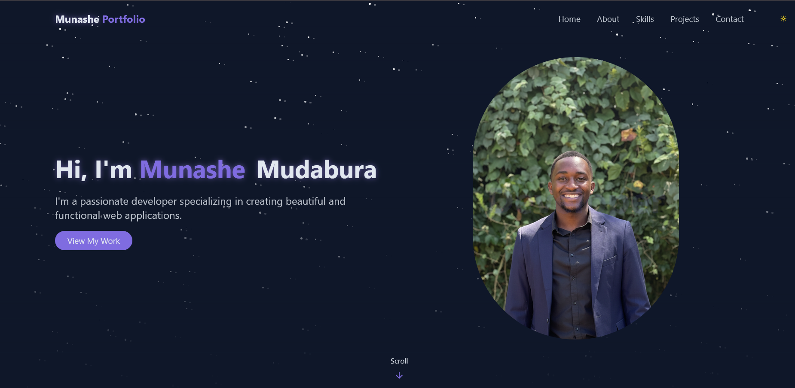
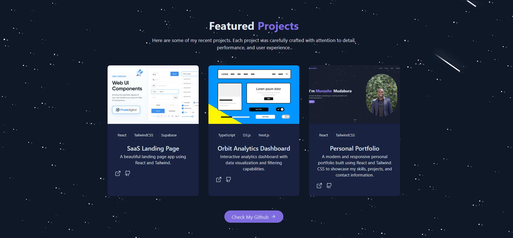
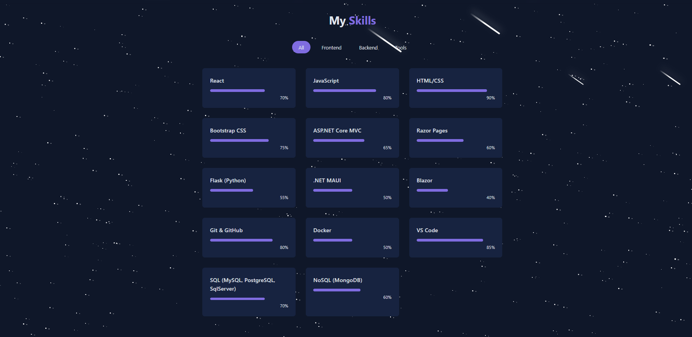
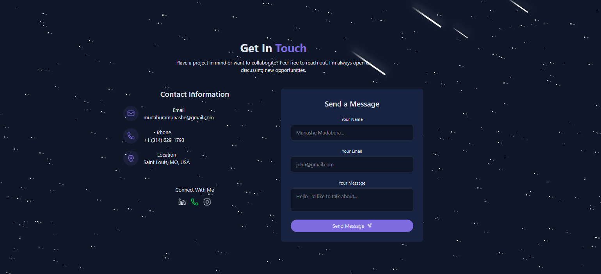

# 🌐 Munashe Mudabura – Portfolio Website



This is my personal **portfolio website** built with **React (via Vite)** and **Tailwind CSS**, showcasing my projects, skills, and experience.  
It features **light/dark mode support**, smooth animations, and a modern responsive design.

🔗 **Live Demo**: [munashemudabura.com](http://munashemudabura.com)

- [Watch Demo](./public/screenshots/demo.mp4)

---

## ✨ Features

- 🎨 **Modern UI/UX** with Tailwind CSS and custom animations
- 🌓 **Light & Dark mode** toggle
- 📂 **Projects section** with GitHub + demo links
- 🛠️ **Skills section** with progress indicators and category filters
- 📞 **Contact form** with email + social links (LinkedIn, Instagram, WhatsApp)
- 🖼️ **Hero section with profile image and intro**
- 📄 **Download CV option**
- 📱 **Fully responsive** across devices

---

## 🚀 Technologies Used

- **[React](https://react.dev/)** (bootstrapped with [Vite](https://vitejs.dev/))
- **[Tailwind CSS](https://tailwindcss.com/)** for styling
- **[Lucide Icons](https://lucide.dev/)** for icons
- **Framer Motion / CSS Animations** for transitions and effects
- **Shadcn/UI components** for polished UI elements

---

## 📸 Screenshots

### 🏠 Hero Section


### 💼 Projects Section



### 🛠️ Skills Section



### 📞 Contact Section



---

## ⚙️ Installation & Setup

Follow these steps to run the portfolio locally:

```bash
# 1️⃣ Clone the repository
git clone https://github.com/mudabs/portfolio.git

# 2️⃣ Navigate into the project folder
cd portfolio

# 3️⃣ Install dependencies
npm install

# 4️⃣ Run the development server
npm run dev
```

## 🐳 Docker

Build and run the portfolio locally in a container:

```bash
docker build -t portfolio-site .
docker run --rm -p 8080:80 portfolio-site
```

Then open `http://localhost:8080`.

## 🚢 GitHub Actions VPS Deployment

This repository includes a workflow at `.github/workflows/deploy.yml` that runs on every push to `main`.

What it does:

- Installs dependencies with `npm ci`
- Builds the Vite app
- Builds a Docker image for the site
- Copies the image archive to your VPS over SSH
- Loads the image on the VPS and restarts the running container

### Required GitHub Secrets

Add these repository secrets before enabling the workflow:

- `VPS_HOST`: VPS hostname or IP address
- `VPS_USER`: SSH user on the VPS
- `VPS_SSH_KEY`: private SSH key used by GitHub Actions

Optional secrets:

- `VPS_SSH_PORT`: SSH port, defaults to `22`
- `VPS_DEPLOY_PATH`: remote folder for image uploads, defaults to `/opt/portfolio`
- `VPS_CONTAINER_NAME`: Docker container name, defaults to `portfolio-site`
- `VPS_HOST_PORT`: host port mapped to container port `80`, defaults to `8080`

### VPS Prerequisites

Your VPS needs:

- Docker installed and running
- The SSH user allowed to run Docker commands
- Nginx or another reverse proxy pointing your domain to the selected host port if you are not publishing directly on port `80`

Example Nginx upstream if the container is bound to port `8080`:

```nginx
location / {
	proxy_pass http://127.0.0.1:8080;
	proxy_set_header Host $host;
	proxy_set_header X-Real-IP $remote_addr;
	proxy_set_header X-Forwarded-For $proxy_add_x_forwarded_for;
	proxy_set_header X-Forwarded-Proto $scheme;
}
```

Once the secrets are set, every push to `main` will build and deploy the updated container automatically.
