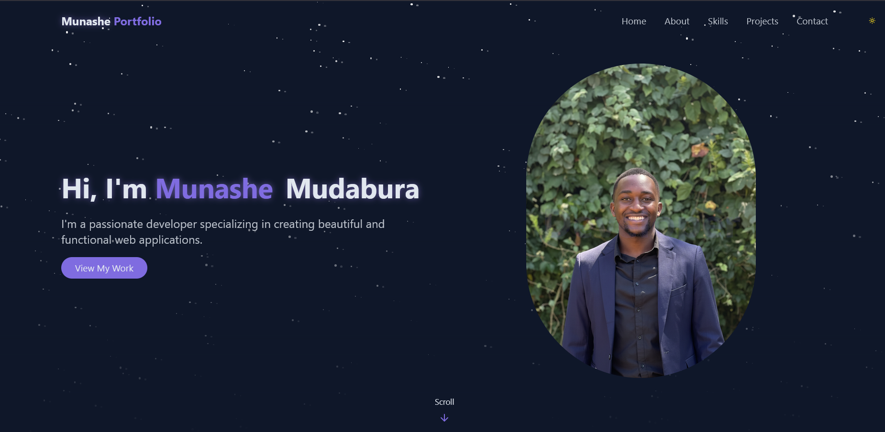
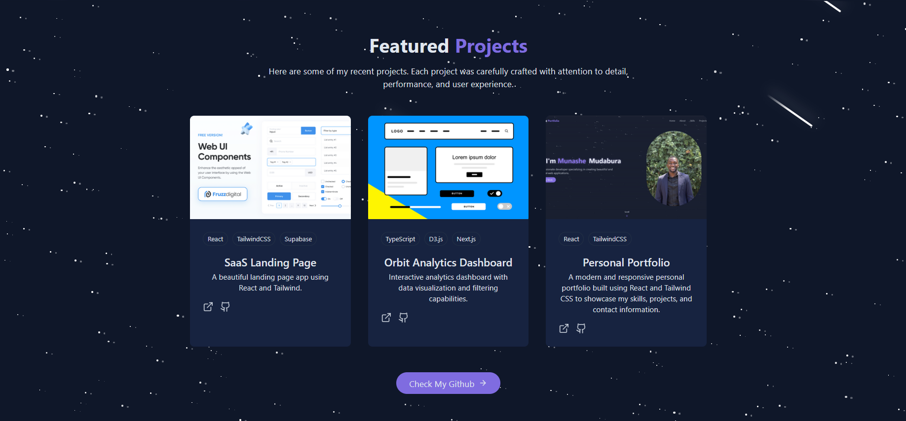
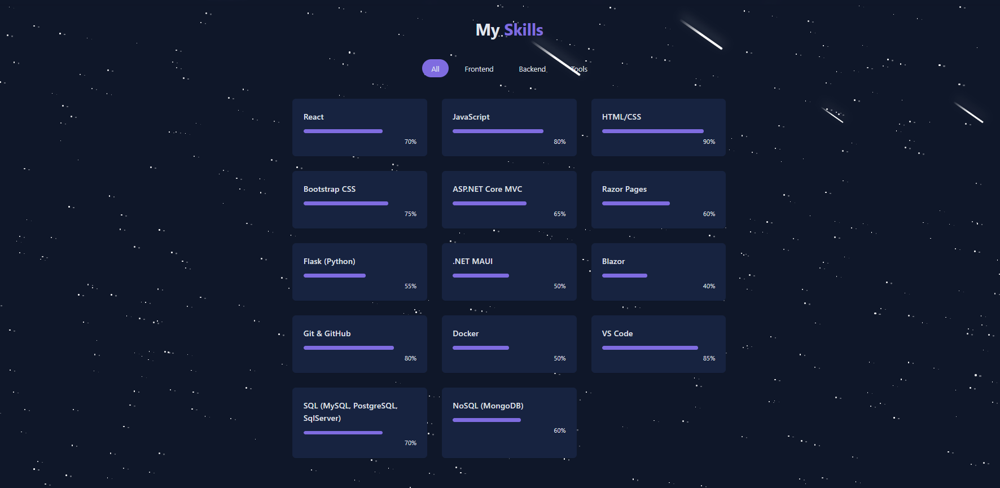
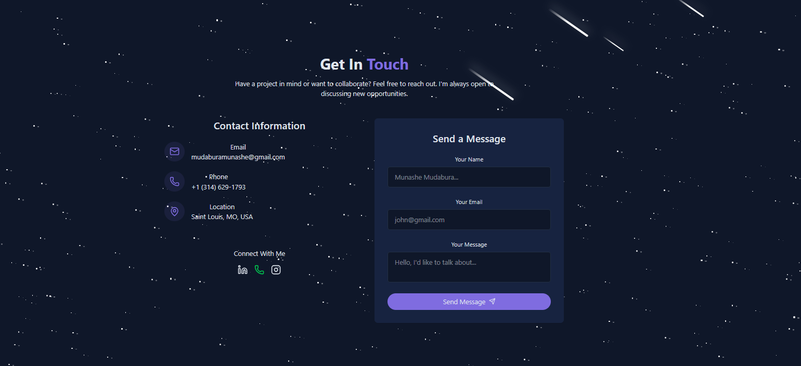

# Munashe Mudabura Portfolio Website



This repository contains my personal portfolio website, built with React through Vite and styled with Tailwind CSS. It presents my projects, technical skills, certifications, and professional background in a responsive single-page application.

Live Demo: [munashemudabura.com](http://munashemudabura.com)

- [Watch Demo](./public/screenshots/demo.mp4)

---

## Features

- Responsive layout designed for desktop and mobile devices
- Theme toggle with light and dark presentation modes
- Project showcase with links to live demos and source repositories
- Skills section with categorized capabilities and progress indicators
- Certifications section highlighting relevant credentials
- Contact section with direct communication and social links
- Hero section with introductory profile content and resume access

---

## Technologies Used

- [React](https://react.dev/) with [Vite](https://vitejs.dev/)
- [Tailwind CSS](https://tailwindcss.com/)
- [Lucide Icons](https://lucide.dev/)
- CSS animations and transition effects
- Shadcn UI components

---

## Screenshots

### Hero Section


### Projects Section



### Skills Section



### Contact Section



---

## Installation and Setup

To run the project locally:

```bash
# 1. Clone the repository
git clone https://github.com/mudabs/portfolio.git

# 2. Navigate to the project directory
cd portfolio

# 3. Install dependencies
npm install

# 4. Start the development server
npm run dev
```

## Docker

To build and run the portfolio in a container:

```bash
docker build -t portfolio-site .
docker run --rm -p 8080:80 portfolio-site
```

Then open `http://localhost:8080`.

## GitHub Actions VPS Deployment

This repository includes a workflow at `.github/workflows/deploy.yml` that runs on every push to `main`.

What it does:

- Installs dependencies with `npm ci`
- Builds the Vite app
- Archives the generated `dist/` folder
- Copies the archive to your VPS over SSH
- Replaces the contents of `/var/www/portfolio` with the latest static build

### GitHub Actions configuration

The workflow deploys on every push to `main` and can be run manually from the
Actions tab. It targets the production VPS `munashe@66.179.81.222` by default.
Add this required repository secret before enabling the workflow:

- `VPS_SSH_KEY`: private SSH key used by GitHub Actions

Optional repository secrets can override the defaults:

- `VPS_HOST` (default: `66.179.81.222`)
- `VPS_USER` (default: `munashe`)

To create the required secret, copy the contents of the private deploy key into
GitHub: **Settings → Secrets and variables → Actions → New repository secret**.
Never commit the private key to this repository.

### VPS Prerequisites

Your VPS needs:

- Nginx configured to serve files from `/var/www/portfolio`
- The SSH user allowed to write into `/var/www/portfolio`

Example Nginx server block:

```nginx
server {
	listen 80;
	server_name munashemudabura.com www.munashemudabura.com;

	root /var/www/portfolio;
	index index.html;

	location / {
		try_files $uri $uri/ /index.html;
	}
}
```

If `munashe` does not own `/var/www/portfolio`, update the directory permissions before using the workflow.

Once the secrets are set, every push to `main` will build and deploy the updated static files automatically.
